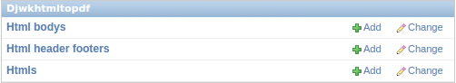
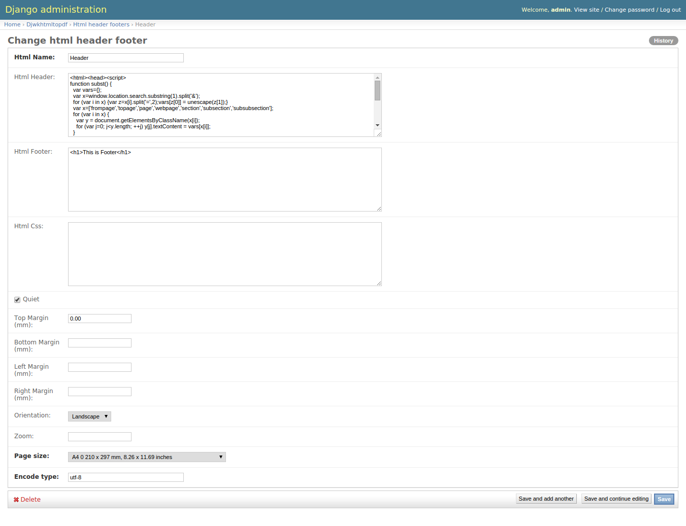
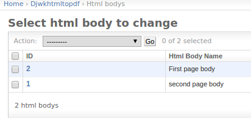
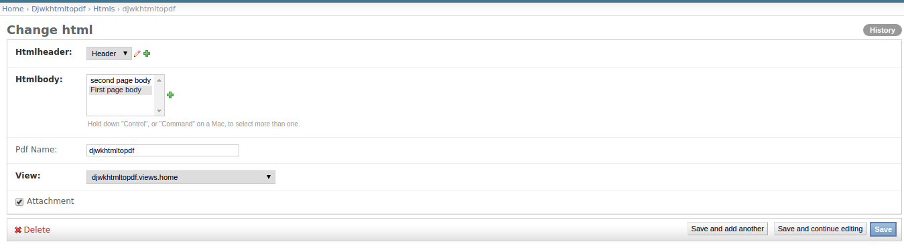

Usage of dj-wkhtmltopdf
=======================

.. toctree::
   :maxdepth: 2

Usage
-----

It contains three models,

    1. HtmlHeaderFooter
        Can manage header and footer and different options of wkhtmltopdf.
    2. HtmlBody
        Can create multiple html bodies.
    3. Html
        You can use HtmlHeaderFooter and HtmlBody in the Html model and you must configure which view
        should generate pdf. Any way I will try to explain the process.

Example
-------

You can see three models as shown below,

HtmlHeaderFooter model
~~~~~~~~~~~~~~~~~~~~~~

Here you can add your header, footer and managing different options, you can see below image

HtmlBody
~~~~~~~~

Here you can create multiple html pages. you can see below image

Html
~~~~

This model is main part, you can attach your header object and html pages. but one field is important that is "view" field,
It shows all your views but make sure which you you want to generate the pdf file. For example you have a view name as 'home'
in the ``example.views`` app the view render like this ``example.views.home``. You can see below image

Exp:

.. code-block:: bash

    from djwkhtmltopdf import convert_html_to_pdf

    def home(request):
        response = convert_html_to_pdf(request=request, context={'page':20, 'name': 'pdf name'})
        return response

